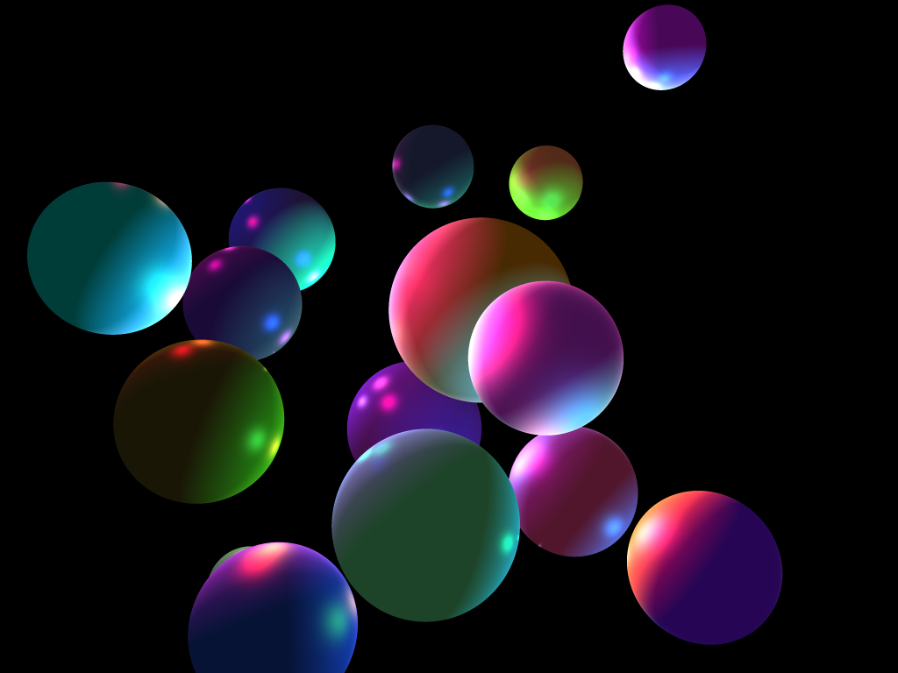

# Stantz



Stantz, named after Dr. Ray Stantz, "the heart of the Ghostbusters," is a ray tracer written in Rust. This is a hobby project for my own enjoyment.

## Examples

### Cornell Box

My take on the famous rendering demo scene.

Usage:

```
cargo run --example cornell_box WIDTH HEIGHT ANTI_ALIASING FILE
```

### Random Spheres

Generates `NUM_SPHERES` spheres with random sizes, positions, colours, and materials, and also `NUM_LIGHTS` random lights with random positions and colours. `SEED` allows recreating the same scene.

Usage:

```
cargo run --example random_spheres NUM_SPHERES NUM_LIGHTS SEED WIDTH HEIGHT ANTI_ALIASING FILE
```

## Roadmap

- [x] Finalize object/material coupling
- [x] Anti-aliasing
- [ ] Pre-calculated normals
- [ ] Read obj files
- [ ] BVH
- [ ] Smooth normals
- [ ] Shadows
- [ ] reflections
- [ ] Transition to path tracing

## References

- https://www.cs.cmu.edu/~blelloch/papers/GHFB13.pdf
